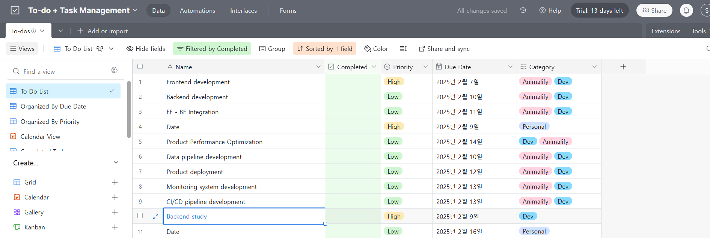

## React Todo Template 개발 요구사항 초안



### 1. 개요

본 문서는 React 기반 Todo Template 개발에 필요한 기능과 디자인 요구사항을 정의합니다. **개인 사용자를 위한 간단한 Todo List 관리**를 목표로 하며, **데이터베이스 연동 없이 로컬 스토리지를 사용하여 데이터를 관리**하고, **Vercel에 간편하게 배포**할 수 있도록 구성합니다. 제공된 이미지를 기반으로 기본적인 Todo List 기능을 구현하고, 다양한 뷰(View)를 제공하여 사용자 편의성을 높이는 것을 목표로 합니다. **Next.js가 아닌 순수 React를 사용합니다.**

### 2. 핵심 기능

*   **Todo 항목 관리:**
    *   Todo 항목 생성, 수정, 삭제 기능
    *   Todo 항목 내용 (Name), 완료 여부 (Completed), 우선순위 (Priority), 마감일 (Due Date), 카테고리 (Category) 속성 관리
*   **다양한 View 제공:**
    *   **Grid View (기본):** Todo 항목을 테이블 형태로 보여주며, 정렬, 필터, 그룹화 기능을 제공합니다.
    *   **Calendar View:** 마감일 (Due Date)을 기준으로 Todo 항목을 캘린더에 표시합니다.
    *   (선택) **Kanban View:**  Todo 항목을 진행 상태별로 관리할 수 있는 칸반 보드 제공 (개발 계획에 따라 추가, 복잡도 고려)
    *   (선택) **List View:** Todo 항목을 목록 형태로 보여줍니다. (개발 계획에 따라 추가, 복잡도 고려)
*   **정렬 및 필터링:**
    *   제목, 우선순위, 마감일, 카테고리 등 다양한 기준으로 Todo 항목 정렬 기능
    *   완료 여부, 우선순위, 카테고리, 마감일 등 다양한 조건으로 Todo 항목 필터링 기능
*   **그룹화:** 우선순위 등 특정 속성을 기준으로 Todo 항목 그룹화 기능
*   **데이터 관리 (로컬 스토리지 기반):**
    *   **`localStorage`**를 사용하여 브라우저에 데이터를 영구 저장합니다. (파일 시스템 대신)**
*   **Vercel 배포 최적화:** 별도의 서버 설정 없이 Vercel에 바로 배포 가능하도록 구성
*   **UI/UX:**
    *   직관적이고 사용하기 쉬운 UI 제공
    *   반응형 디자인을 통해 다양한 환경에서 최적화된 사용자 경험 제공

### 3. 상세 요구사항

*   **Grid View:**
    *   각 열별로 정렬 기능 제공 (제목, 우선순위, 마감일, 카테고리)
    *   필터링 옵션 제공 (완료 여부, 우선순위, 카테고리, 마감일 범위)
    *   그룹화 옵션 제공 (우선순위)
    *   각 항목별 색상 설정 기능 (Color) (선택 사항)
    *   Share and sync 기능 (제외, 개인용이므로 불필요)
*   **Calendar View:**
    *   Todo 항목의 마감일을 캘린더에 표시
    *   캘린더에서 Todo 항목 클릭 시 상세 정보 확인 및 수정 기능
    *   월별, 주별 보기 옵션 제공 (선택 사항)
*   **정렬 및 필터링:**
    *   다양한 정렬 옵션 (제목 오름차순/내림차순, 우선순위 높음/낮음, 마감일 가까운 날짜/먼 날짜)
    *   필터링 조건 (완료/미완료, 특정 우선순위, 특정 카테고리, 특정 마감일 범위)
*   **데이터 관리 (로컬 스토리지 기반):**
    *   **`localStorage.setItem()` 및 `localStorage.getItem()`**을 사용하여 Todo 항목 데이터를 저장하고 불러옵니다.
    *   페이지 로드 시 로컬 스토리지에서 데이터를 불러와 초기 상태로 설정합니다.
    *   Todo 항목 추가, 수정, 삭제 시 로컬 스토리지에 데이터를 업데이트합니다.
*   **UI 디자인:**
    *   전체적인 레이아웃 및 컬러 팔레트는 제공된 이미지를 참고
    *   각 기능별 버튼 및 아이콘 디자인은 직관적이고 이해하기 쉽게 구성
*   **반응형 디자인:**
    *   데스크탑, 태블릿, 모바일 등 다양한 디바이스에서 최적화된 화면 제공
    *   각 디바이스별 UI/UX 고려
*   **Vercel 배포:**
    *   별도의 서버 설정 없이 정적 파일로 배포 가능하도록 구성

### 4. 기술 스택

*   React
*   (선택) TypeScript
*   (선택) Tailwind CSS 또는 Styled Components
*   **Vite (빌드 도구)**

### 5. 개발 환경 설정 (Vite 기반)

1.  **프로젝트 초기화:**

    > **주의:** Next.js가 아닌 Vite + React를 사용해야 합니다. 잘못된 설정을 방지하기 위해 아래 명령어를 정확히 따르세요.

    ```bash
    # 1. TypeScript + React 프로젝트 생성
    npm create vite@latest todo_template -- --template react-ts
    
    # 2. 프로젝트 폴더로 이동
    cd todo_template
    
    # 3. 기본 의존성 설치
    npm install
    
    # 4. 추가 의존성 설치
    npm install @heroicons/react date-fns react-calendar
    npm install -D @types/react-calendar tailwindcss postcss autoprefixer
    ```

    > **트러블슈팅:** 프로젝트 초기화 단계에서 발생할 수 있는 주요 문제
    > - package.json 누락: 프로젝트 초기화를 건너뛰면 발생
    > - 잘못된 템플릿 사용: Next.js나 일반 React 템플릿 대신 react-ts 템플릿 사용 필요
    > - 의존성 누락: 필요한 모든 패키지가 설치되어 있는지 확인

2.  **`package.json` 수정 (scripts):**
    ```json
    {
      "name": "todo-template",
      "private": true,
      "version": "0.0.0",
      "type": "module",
      "scripts": {
        "dev": "vite",
        "build": "tsc && vite build",
        "lint": "eslint . --ext ts,tsx --report-unused-disable-directives --max-warnings 0",
        "preview": "vite preview"
      },
      "dependencies": {
        "@heroicons/react": "^2.1.1",
        "date-fns": "^3.3.1",
        "react": "^18.2.0",
        "react-calendar": "^4.8.0",
        "react-dom": "^18.2.0"
      },
      "devDependencies": {
        "@types/react": "^18.2.43",
        "@types/react-calendar": "^4.1.0",
        "@types/react-dom": "^18.2.17",
        "@typescript-eslint/eslint-plugin": "^6.14.0",
        "@typescript-eslint/parser": "^6.14.0",
        "@vitejs/plugin-react": "^4.2.1",
        "autoprefixer": "^10.4.17",
        "eslint": "^8.55.0",
        "eslint-plugin-react-hooks": "^4.6.0",
        "eslint-plugin-react-refresh": "^0.4.5",
        "postcss": "^8.4.33",
        "tailwindcss": "^3.4.1",
        "typescript": "^5.2.2",
        "vite": "^5.0.8"
      }
    }
    ```

3.  **`index.html` 수정 (필요 시):** 필요에 따라 `<title>` 등을 수정합니다.
4.  **컴포넌트 작성:**  `src/components/` 폴더에 컴포넌트를 만들고 `src/App.jsx`에서 불러와 사용합니다.
5.  **`npm run dev` 실행:**  개발 서버를 시작합니다.

### 6. 개발 단계

1.  **React 프로젝트 설정 및 기본 파일 구조 생성:**  `src/components/`, `src/App.jsx`, `src/main.jsx` 등
2.  **기본 Todo List 기능 구현:**  Todo 항목 생성, 수정, 삭제, 완료/미완료 처리 (로컬 스토리지 연동)
3.  **Grid View 구현:** 테이블 형태로 Todo 항목 표시 및 정렬, 필터 기능 구현
4.  **Calendar View 구현:** 캘린더에 Todo 항목 표시 및 상세 정보 확인 기능 구현
5.  **데이터 관리 기능 구현:** 로컬 스토리지 데이터 저장 및 로드 (핵심)
6.  **UI/UX 개선:** 디자인 및 사용성 개선
7.  **Vercel 배포 준비:** 정적 파일 설정 및 배포 테스트
8.  (선택) 추가 기능 구현: Kanban View, List View, 그룹화, 색상 설정 등

### 7. 참고 이미지

제공된 이미지를 참고하여 UI 디자인 및 기능 구현에 반영합니다.

### 8. 규제 사항

*   **트러블 슈팅:**
    *   개발 중 발생하는 문제점을 `/troubleshooting/` 폴더에 `트러블 슈팅 이름.md` 파일로 기록하고 해결 과정을 추적합니다.
    *   아래 템플릿을 사용하여 작성합니다.
    *   **트러블 슈팅 템플릿 (troubleshooting.md):**  (템플릿은 아래 제공)
    *   **만약 `/troubleshooting/` 폴더가 존재하지 않으면 직접 생성합니다.**

*   **라이선스:**
    *   MIT License를 적용하여 소스 코드 사용 및 배포에 대한 허용 범위를 명시합니다.
    *   아래 라이선스 텍스트를 `LICENSE` 파일에 저장합니다.
    *   **만약 `LICENSE` 파일이 존재하지 않으면 직접 생성하고 아래 텍스트를 입력합니다.**
    *   **MIT License:** (라이선스 텍스트는 아래 제공)

### 9. 필수 파일 구조

프로젝트는 다음과 같은 필수 파일 구조를 가져야 합니다:

```
todo_template/
├── src/                      # 소스 코드
│   ├── components/           # React 컴포넌트
│   │   └── ...
│   ├── hooks/               # Custom Hooks
│   ├── types/               # TypeScript 타입 정의
│   └── ...
├── troubleshooting/         # 트러블슈팅 문서
│   └── *.md                 # 각 문제 해결 과정
├── README.md                # 프로젝트 설명
├── LICENSE                  # MIT 라이선스
├── package.json             # 프로젝트 설정
└── ...
```

**중요: 모든 필수 파일은 반드시 생성되어야 합니다**

* README.md: 프로젝트 설명, 설치 방법, 실행 방법 등을 포함
* LICENSE: MIT 라이선스 전문을 포함
* troubleshooting/: 개발 중 발생하는 모든 문제와 해결 과정을 기록

**규칙:**
1. 파일이나 폴더가 없는 경우 즉시 생성
2. 모든 트러블슈팅은 문서화
3. 라이선스 파일은 반드시 포함
4. README.md는 최신 상태 유지

---

**트러블 슈팅 템플릿 (troubleshooting.md)**

```markdown
## 트러블 슈팅

### 문제 개요

*   발생 시점: (문제 발생 시점)
*   문제 내용: (문제에 대한 구체적인 설명)
*   재현 방법: (문제를 재현할 수 있는 단계별 설명)
*   예상 결과: (정상적인 상황에서 예상되는 결과)
*   실제 결과: (실제로 발생한 결과)

### 시도해본 해결 방법

1.  (시도한 해결 방법 1): (결과)
2.  (시도한 해결 방법 2): (결과)
3.  (시도한 해결 방법 3): (결과)

### 원인 분석

*   (문제의 근본적인 원인 분석)

### 해결 방법

*   (문제 해결을 위한 구체적인 방법)
*   (코드 스니펫 또는 설정 변경 사항)

### 추가 정보

*   (참고 자료 링크, 스크린샷 등)

### 해결 여부

*   [ ] 해결 완료
*   [ ] 해결 중
*   [ ] 해결 실패

### 관련 이슈

*   (관련된 GitHub 이슈 번호)

### 작성자

*   (작성자 이름)

### 작성일

*   (작성일)
```

---

**README.md (초안)**

```markdown
# React Todo Template (Personal - LocalStorage)

개인 사용자를 위한 간단한 React 기반 Todo List 템플릿입니다. 로컬 스토리지를 사용하여 데이터를 저장하며, Vercel에 간편하게 배포할 수 있습니다.

## 주요 기능

*   Todo 항목 생성, 수정, 삭제
*   Grid View, Calendar View (선택적으로 Kanban, List View)
*   정렬 및 필터링
*   로컬 스토리지 기반 데이터 저장
*   반응형 디자인

## 기술 스택

*   React
*   (선택) TypeScript
*   (선택) Tailwind CSS 또는 Styled Components
*   Vite

## 시작하기

1.  저장소를 클론합니다.
    ```bash
    git clone [저장소 주소]
    ```
2.  프로젝트 디렉토리로 이동합니다.
    ```bash
    cd [프로젝트 디렉토리]
    ```
3.  패키지를 설치합니다.
    ```bash
    npm install 또는 yarn install
    ```

## 실행 방법

```bash
npm run dev 또는 yarn dev
```

브라우저에서 `http://localhost:5173` (또는 Vite에서 제시하는 주소)로 접속합니다.

## 배포 방법 (Vercel)

1.  Vercel 계정을 생성합니다.
2.  Vercel CLI를 설치합니다.
    ```bash
    npm install -g vercel
    ```
3.  프로젝트 디렉토리에서 `vercel` 명령어를 실행하여 배포합니다.

## 라이선스

MIT License ([LICENSE 파일](LICENSE))

## 기여 방법

(기여 방법에 대한 설명, 개인 프로젝트이므로 생략 가능)

## 문의 사항

(문의 사항이 있을 경우 연락처 또는 이메일 주소)
```

---

**MIT License**

```
MIT License

Copyright (c) [년도] [저작권자 이름]

본 라이선스에 의거하여 이 소프트웨어 및 관련 문서 파일("소프트웨어")을 사용, 복제, 수정, 병합, 게시, 배포, 서브라이선스 설정 및 판매할 권한이 부여됩니다. 단, 다음 조건에 동의해야 합니다.

본 저작권 고지 및 본 허가 고지는 소프트웨어의 모든 복제본 또는 중요한 부분에 포함되어야 합니다.

소프트웨어는 상품성, 특정 목적에의 적합성 및 비침해에 대한 보증을 포함하여 명시적이든 묵시적이든 어떠한 종류의 보증도 없이 "있는 그대로" 제공됩니다. 저작권자 또는 라이선스 소유자는 계약, 불법 행위 또는 기타 방식으로 인해 발생하는 소프트웨어 또는 소프트웨어 사용 또는 기타 거래로 인해 발생하는 모든 청구, 손해 또는 기타 책임에 대해 책임을 지지 않습니다.
```

---

본 초안은 개발 진행 상황에 따라 변경될 수 있습니다.  **개인 사용을 위한 간단한 Todo List 구현 및 Vercel 배포**에 초점을 맞추어 개발하며, **규제 사항**을 준수합니다. **만약 폴더나 파일이 없는 경우 직접 생성해야 합니다.**  **[년도]** 및 **[저작권자 이름]**은 실제 값으로 변경해야 합니다.

### 10. 알려진 문제점과 해결 방법

1. **프로젝트 초기화 관련 문제**
   - 문제: package.json 파일 누락
   - 원인: Vite 프로젝트 생성 단계를 건너뜀
   - 해결: 위의 개발 환경 설정 단계를 정확히 따라 프로젝트 초기화

2. **Next.js 관련 문제**
   - 문제: Next.js 기반으로 시작했을 때 발생하는 오류
   - 원인: 프로젝트 요구사항과 기술 스택 불일치
   - 해결: Vite + React-ts 템플릿으로 프로젝트 재생성

> 각 문제에 대한 자세한 해결 과정은 `/troubleshooting/` 폴더의 해당 문서를 참고하세요.